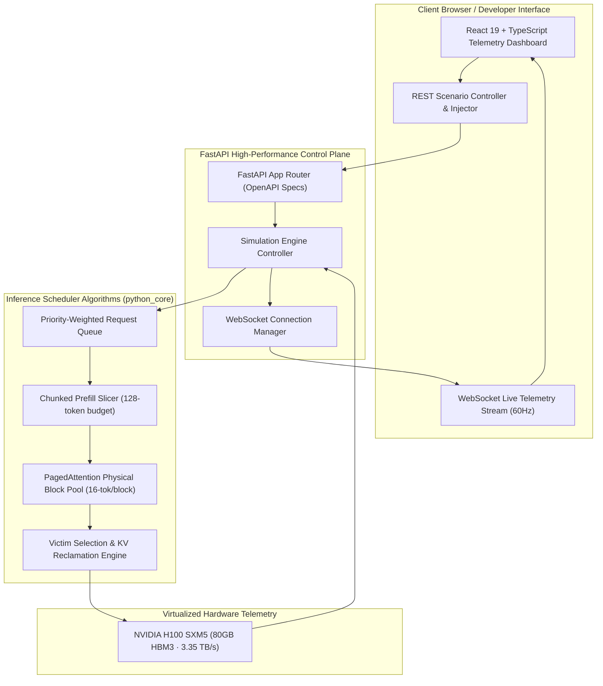

# ⚡ LLM Inference Control Plane & Observability Suite

<p align="center">
  
  
  
  
  
  
</p>

An enterprise-grade, high-performance **LLM Request Scheduling Engine & Real-Time Telemetry Observability Platform**. This project models production LLM inference architectures (matching engine behaviors like **vLLM**, **Hugging Face TGI**, and **SGLang** on virtualized **NVIDIA H100 / A100 GPUs**) including **First-Come-First-Served (FCFS), Chunked Prefill, PagedAttention KV-Cache Virtualization, Dynamic Request Preemption, and Priority-Aware Fast-Lane Scheduling**.

---

## 🏗️ System Architecture



---

## 🚀 Key Features

- **📖 6-Level Interactive Architectural Journey**:
  - Toggle between **👶 ELI5 Mode** (intuitive hospital ER & warehouse analogies) and **⚡ Tech Mode** (low-level kernel equations, HBM3 bandwidth, and VRAM memory layout).
  - Step-by-step interactive simulations demonstrating the core failure modes and algorithmic solutions in modern LLM serving.
- **⚡ High-Performance Telemetry Backend (`backend/`)**:
  - Full-duplex WebSocket telemetry broadcasting live GPU hardware step metrics (TTFT p99, TPOT, SM Compute %, HBM Bandwidth %).
  - REST API endpoints for scenario triggers, playback speed adjustment, and live prompt injection.
- **📊 Silicon Studio Cleanroom Dashboard (`frontend/`)**:
  - PagedAttention 32-block physical VRAM memory matrix grid.
  - Live execution pipeline conveyor belt and request injector station.
  - 100% responsive, high-contrast, professional design system.

---

## 🎯 Architecture Modules & Scheduling Strategies

| Module | Semantic Route | Description | Key Algorithmic Mechanism |
| :--- | :--- | :--- | :--- |
| **1. The Problem** | [`/problem`](http://localhost:5173/problem) | **Naive Concurrent Execution** | Unbounded memory allocation leading to catastrophic CUDA OOM. |
| **2. Fair Queue** | [`/fcfs`](http://localhost:5173/fcfs) | **First-Come, First-Served** | FIFO queue eliminating crashes but suffering from Head-of-Line prefill blocking. |
| **3. Smart Chunks** | [`/chunked-prefill`](http://localhost:5173/chunked-prefill) | **Chunked Prefill (Sarathi/vLLM)** | Splits prompt contexts into 128-token slices to interleave decode tokens and eliminate latency spikes. |
| **4. Memory Warehouse** | [`/kv-capacity`](http://localhost:5173/kv-capacity) | **PagedAttention Block Virtualization** | Non-contiguous 16-token physical KV memory blocks eliminating internal memory fragmentation. |
| **5. Emergency Evict** | [`/preemption`](http://localhost:5173/preemption) | **Dynamic Victim Preemption** | Reclaims physical KV blocks by preempting active jobs when VRAM reaches 100% capacity. |
| **6. VIP Fast Lane** | [`/priority-preemption`](http://localhost:5173/priority-preemption) | **Priority-Aware Preemption** | Production-tier scheduling guaranteeing strict sub-50ms TTFT latency for high-priority requests. |
| **🏭 Live Factory** | [`/factory`](http://localhost:5173/factory) | **Grand Finale Live Simulation Floor** | Full production control plane with real-time GPU metrics and live prompt injection. |
| **📚 Documentation** | [`/docs`](http://localhost:5173/docs) | **Developer Specs & Glossary** | Technical formulas, WebSocket payload schemas, and algorithmic reference guides. |

---

## ⚡ Running Locally

### Option A: Standard Local Setup

#### 1. Run Python Unit Tests
```bash
uv run python python_core/test_runner.py all
```

#### 2. Start FastAPI Backend Server
```bash
uv run python -m uvicorn backend.main:app --host 0.0.0.0 --port 8000 --reload
```
- Interactive OpenAPI Docs: `http://localhost:8000/docs`
- WebSocket Telemetry: `ws://localhost:8000/ws/telemetry`

#### 3. Start React Frontend
```bash
cd frontend
npm install
npm run dev
```
Open **`http://localhost:5173/`** in your browser.

---

### Option B: Docker 1-Command Startup
```bash
docker compose up --build
```
Access the application at `http://localhost:8000/`.

---

## 📁 Repository Structure

```
.
├── .github/workflows/ci.yml # Automated CI pipeline for tests & builds
├── Dockerfile               # Production multi-stage Docker build
├── docker-compose.yml       # 1-command container orchestration
├── pyproject.toml           # Python package & dependency configuration
├── README.md                # Comprehensive architecture documentation
├── LICENSE                  # MIT Open Source License
├── backend/                 # High-performance FastAPI control plane
│   ├── main.py              # Application entrypoint & CORS setup
│   ├── config.py            # Server settings & environment variables
│   ├── api/                 # REST & WebSocket telemetry endpoints
│   ├── core/                # Simulation harness & hardware specs
│   └── middleware/          # Security headers & rate limiting
├── frontend/                # React 19 + TypeScript + Vite Dashboard
│   ├── src/pages/           # Dedicated chapter pages & documentation
│   ├── src/components/      # Factory floor & story navigation components
│   ├── src/context/         # Dual-mode (ELI5 vs Tech) state provider
│   ├── vercel.json          # Free-tier Vercel SPA deployment configuration
│   └── src/App.tsx          # Live Factory simulation arena
└── python_core/             # Core Python simulation engine & scheduler algorithms
    ├── api.py               # Data models (Request, StepPlan, EngineView)
    ├── engine.py            # Simulation engine & validation harness
    ├── fcfs_scheduler.py    # Level 2 FCFS implementation
    ├── chunked_prefill_scheduler.py     # Level 3 Chunked Prefill implementation
    ├── kv_capacity_scheduler.py         # Level 4 PagedAttention capacity limits
    ├── preemption_scheduler.py          # Level 5 Victim eviction implementation
    ├── priority_preemption_scheduler.py # Level 6 Priority preemption implementation
    └── test_runner.py       # Automated unit test suite
```

---

## 👤 Author & Contact

**Malav Champaneria**
- 🌐 **Portfolio**: [https://malavchampaneria.com/](https://malavchampaneria.com/)
- 💼 **LinkedIn**: [https://www.linkedin.com/in/malav-champaneria](https://www.linkedin.com/in/malav-champaneria)
- 🐙 **GitHub**: [https://github.com/Malav786](https://github.com/Malav786)
- ✉️ **Email**: [mchamp.2509@gmail.com](mailto:mchamp.2509@gmail.com)

---

## 📄 License

This project is licensed under the [MIT License](file:///e:/TRIAL/LICENSE).
