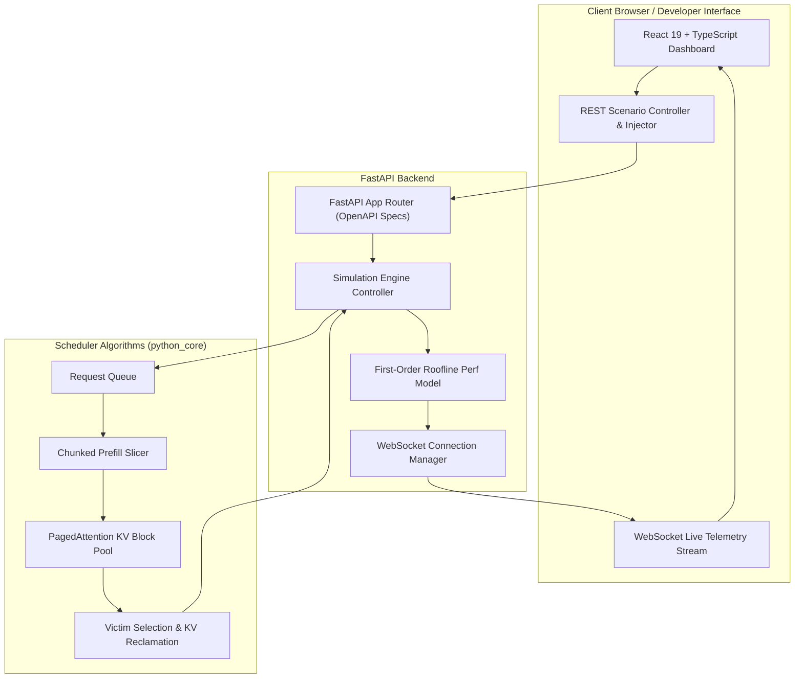

# 🏭 LLM Inference Scheduler & Teaching Dashboard

<p align="center">
  
  
  
  
  
  
</p>

An **educational simulation** of LLM request scheduling, inspired by production systems like vLLM and Hugging Face TGI. It implements correct versions of **First-Come-First-Served (FCFS), Chunked Prefill, PagedAttention KV-Cache Management, Dynamic Request Preemption, and Priority-Aware Scheduling** — then visualises them in a real-time interactive dashboard.

> **What this is:** A teaching tool and portfolio project. The scheduler algorithms are original implementations; the simulation harness is adapted from a provided exercise framework (see [`python_core/README.md`](python_core/README.md)).
>
> **What the metrics are:** Performance numbers (TTFT, TPOT, SM compute %, HBM bandwidth %) are **modelled estimates** from a first-order roofline model — compute-bound for prefill, bandwidth-bound for decode. They are not measured from real GPU hardware. The dashboard labels all telemetry as *"Modeled Estimate"*.

---

## 🏗️ System Architecture



---

## 🚀 Key Features

- **📖 6-Level Interactive Architectural Journey**:
  - Toggle between **👶 ELI5 Mode** (hospital ER & warehouse analogies) and **⚡ Tech Mode** (HBM bandwidth equations, VRAM layout).
  - Step-by-step simulations demonstrating real failure modes and algorithmic solutions.
- **⚡ Real-Time Simulation Backend (`backend/`)**:
  - Full-duplex WebSocket telemetry with one engine step per real-time tick (not pre-computed replay).
  - Live prompt injection: requests enter the running simulation at the next engine step.
  - REST API for scenario control, speed adjustment, and request injection.
  - Optional API-key authentication via `API_KEY` environment variable.
- **📊 Interactive Dashboard (`frontend/`)**:
  - PagedAttention 32-block VRAM memory grid.
  - Live execution pipeline conveyor belt and request injector.
  - All metrics clearly labelled **"Modeled Estimate"** — no fabricated hardware readings.

---

## 📐 Performance Model

Metrics shown in the dashboard are **modelled estimates** from a first-order roofline model, not hardware measurements.

| Metric | Model | Assumption |
|---|---|---|
| Prefill latency | `FLOPs / (fp16_tflops × MFU)` | Compute-bound; `FLOPs ≈ 2 × params × tokens`; MFU = 0.40 |
| Decode latency | `bytes / hbm_bandwidth` | BW-bound; `bytes = weight_bytes + kv_bytes × context_len` |
| TTFT | `queue_wait_steps × tick_ms + prefill_ms` | Tick duration = configurable (default 250 ms) |
| TPOT | Decode latency per token | Per-token BW-bound decode estimate |
| SM util % | `prefill_flops / (peak_flops × tick_s)` | Fraction of achievable compute |
| HBM util % | `decode_bytes / (peak_bw × tick_s)` | Fraction of peak bandwidth |

Model profile: synthetic **7B-class decoder** (7B params, 32 layers, hidden=4096, GQA with 32 KV heads). Representative of publicly documented open-source model families.

Reported p50/p95/p99 percentiles are computed from a rolling window of the last 200 samples — `null` when the window is empty.

---

## 🎯 Architecture Modules & Scheduling Strategies

| Module | Route | Description | Key Mechanism |
| :--- | :--- | :--- | :--- |
| **1. The Problem** | [`/problem`](http://localhost:5173/problem) | **Naive Concurrent Execution** | Unbounded memory allocation → OOM. |
| **2. Fair Queue** | [`/fcfs`](http://localhost:5173/fcfs) | **First-Come, First-Served** | FIFO eliminating crashes, but suffering from Head-of-Line blocking. |
| **3. Smart Chunks** | [`/chunked-prefill`](http://localhost:5173/chunked-prefill) | **Chunked Prefill (Sarathi/vLLM)** | Splits prompts into 128-token slices to interleave decode tokens. |
| **4. Memory Warehouse** | [`/kv-capacity`](http://localhost:5173/kv-capacity) | **PagedAttention Block Management** | Non-contiguous 16-token physical KV blocks eliminating fragmentation. |
| **5. Emergency Evict** | [`/preemption`](http://localhost:5173/preemption) | **Dynamic Victim Preemption** | Reclaims KV blocks by preempting active jobs at capacity. |
| **6. VIP Fast Lane** | [`/priority-preemption`](http://localhost:5173/priority-preemption) | **Priority-Aware Preemption** | Strict priority scheduling with modelled latency estimates. |
| **🏭 Live Factory** | [`/factory`](http://localhost:5173/factory) | **Real-Time Simulation Dashboard** | Full control plane with modelled telemetry and live prompt injection. |
| **📚 Documentation** | [`/docs`](http://localhost:5173/docs) | **Developer Specs & Glossary** | WebSocket payload schemas and algorithmic reference guides. |

---

## 🔐 API Authentication

By default the server runs in **open-access mode** — no key required. To enable
API-key authentication, set the `API_KEY` environment variable:

```bash
export API_KEY=your-secret-key
```

Protected routes then require the `X-API-Key` request header matching that value.
Missing or incorrect key returns HTTP 401.  See [`.env.example`](.env.example).

---

## ⚡ Running Locally

### Option A: Standard Local Setup

#### 1. Run Python Unit Tests
```bash
uv run python python_core/test_runner.py all
```

#### 2. Run Backend Tests
```bash
uv run pytest backend/tests/ -v
```

#### 3. Start FastAPI Backend Server
```bash
uv run python -m uvicorn backend.main:app --host 0.0.0.0 --port 8000 --reload
```
- Interactive OpenAPI Docs: `http://localhost:8000/docs`
- WebSocket Telemetry: `ws://localhost:8000/ws/telemetry`

#### 4. Start React Frontend
```bash
cd frontend
npm install
npm run dev
```
Open **`http://localhost:5173/`** in your browser.

#### 5. Run Frontend Tests
```bash
cd frontend
npm test
```

---

### Option B: Docker 1-Command Startup
```bash
docker compose up --build
```
Access the application at `http://localhost:8000/`.

---

## 📁 Repository Structure

```
.
├── .github/workflows/ci.yml # CI pipeline: scheduler tests, backend pytest, frontend build + test
├── Dockerfile               # Production multi-stage Docker build
├── docker-compose.yml       # 1-command container orchestration
├── pyproject.toml           # Python package & dependency configuration
├── README.md                # Project documentation
├── LICENSE                  # MIT Open Source License
├── backend/                 # FastAPI backend
│   ├── main.py              # Application entrypoint & CORS setup
│   ├── config.py            # Server settings & environment variables
│   ├── api/                 # REST & WebSocket endpoints
│   ├── core/                # Simulation engine, hardware specs, perf model
│   │   └── perf_model.py    # First-order roofline performance model
│   ├── middleware/          # Security headers, rate limiting, API-key check
│   └── tests/               # Backend pytest suite
├── frontend/                # React 19 + TypeScript + Vite Dashboard
│   ├── src/pages/           # Dedicated chapter pages & documentation
│   ├── src/components/      # Factory floor & story navigation components
│   ├── src/context/         # Dual-mode (ELI5 vs Tech) state provider
│   ├── src/test/            # Vitest smoke tests
│   └── src/App.tsx          # Live Factory simulation arena
└── python_core/             # Scheduler algorithms & simulation harness
    ├── README.md            # Attribution: original work vs. provided harness
    ├── api.py               # Data models (provided exercise contract)
    ├── engine.py            # Simulation harness (provided + additive stepwise API)
    ├── fcfs_scheduler.py    # Level 2: FCFS (original)
    ├── chunked_prefill_scheduler.py     # Level 3: Chunked Prefill (original)
    ├── kv_capacity_scheduler.py         # Level 4: PagedAttention capacity (original)
    ├── preemption_scheduler.py          # Level 5: Victim eviction (original)
    ├── priority_preemption_scheduler.py # Level 6: Priority preemption (original)
    └── test_runner.py       # Automated unit test suite
```

---

## 🔬 Attribution

The **scheduler implementations** (`fcfs_scheduler.py`, `chunked_prefill_scheduler.py`, `kv_capacity_scheduler.py`, `preemption_scheduler.py`, `priority_preemption_scheduler.py`) are original work.

The **simulation harness** (`engine.py` and `api.py`) is adapted from a provided exercise framework. See [`python_core/README.md`](python_core/README.md) for details. An additive `Engine.run_stepwise()` generator was added to support real-time stepping; the original `Engine.run()` and all provided tests are unchanged.

---

## 👤 Author & Contact

**Malav Champaneria**
- 🌐 **Portfolio**: [https://malavchampaneria.com/](https://malavchampaneria.com/)
- 💼 **LinkedIn**: [https://www.linkedin.com/in/malav-champaneria](https://www.linkedin.com/in/malav-champaneria)
- 🐙 **GitHub**: [https://github.com/Malav786](https://github.com/Malav786)
- ✉️ **Email**: [mchamp.2509@gmail.com](mailto:mchamp.2509@gmail.com)

---

## 📄 License

This project is licensed under the [MIT License](LICENSE).
